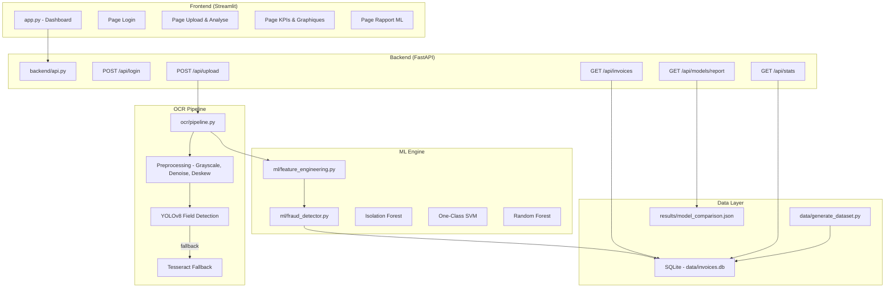
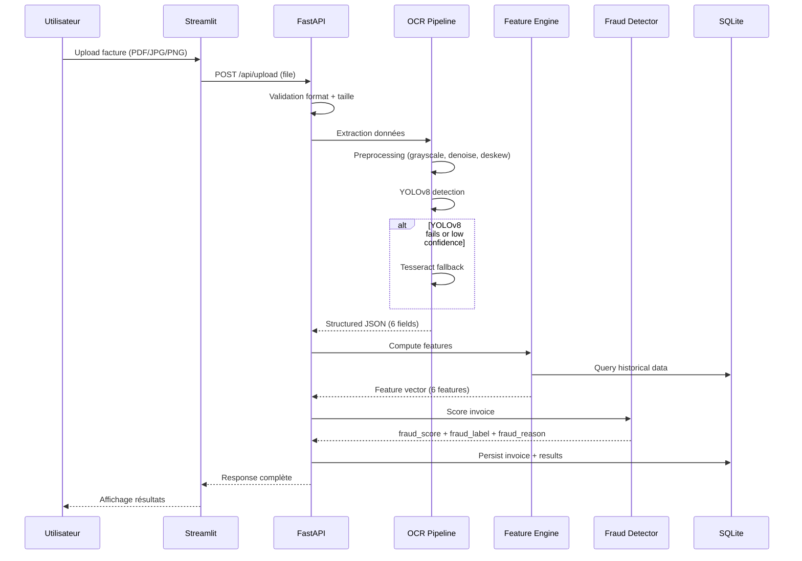
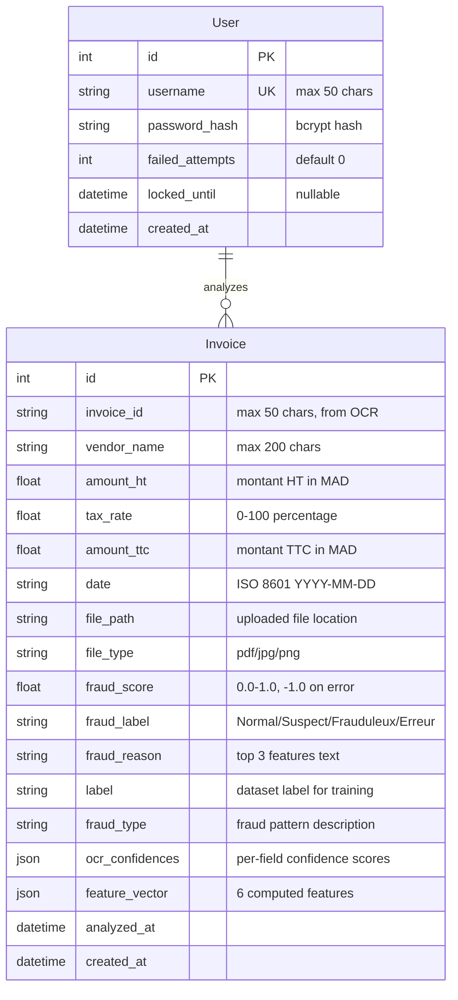

# Design Document: Invoice Fraud Detection

## Overview

Le système de détection de fraude sur factures est une application web full-stack permettant à un bureau comptable marocain d'uploader des factures (PDF/image), d'en extraire automatiquement les données via OCR, puis de calculer un score de fraude via des modèles ML. L'architecture suit un pattern modulaire avec séparation claire entre frontend (Streamlit), backend API (FastAPI), pipeline OCR (YOLOv8 + Tesseract), et moteur ML (scikit-learn).

### Objectifs techniques
- Pipeline end-to-end : upload → OCR → feature engineering → scoring ML → persistance → affichage
- Comparaison de 3 modèles ML avec métriques standardisées
- Dataset synthétique marocain réaliste pour l'entraînement
- Authentification JWT simple avec compte démo
- Résultats systématiques : fraud_score (0-1), fraud_label, fraud_reason

## Architecture

### Diagramme de composants



### Flux de données principal



## Components and Interfaces

### 1. Auth Module (`backend/auth.py`)

```python
# Interface du module d'authentification
class AuthModule:
    def create_token(self, username: str) -> str:
        """Génère un JWT token valide 24h"""
        ...

    def verify_token(self, token: str) -> dict:
        """Vérifie et décode un JWT token"""
        ...

    def authenticate(self, username: str, password: str) -> Optional[str]:
        """Authentifie et retourne un token ou None"""
        ...

    def check_lockout(self, username: str) -> bool:
        """Vérifie si le compte est verrouillé (5 échecs → 15 min)"""
        ...
```

### 2. OCR Pipeline (`ocr/pipeline.py`)

```python
@dataclass
class OCRResult:
    invoice_id: Optional[str]       # max 50 chars
    vendor_name: Optional[str]      # max 200 chars
    amount: Optional[float]         # 0.01 - 999,999,999.99 MAD
    date: Optional[str]             # ISO 8601 YYYY-MM-DD
    tax_rate: Optional[float]       # 0 - 100 (%)
    total: Optional[float]          # 0.01 - 999,999,999.99 MAD
    field_confidences: Dict[str, float]  # per-field confidence 0.0-1.0
    warnings: List[str]             # missing field warnings

class OCRPipeline:
    def preprocess(self, image: np.ndarray) -> np.ndarray:
        """Grayscale, denoise, deskew"""
        ...

    def detect_fields_yolo(self, image: np.ndarray) -> Dict[str, Any]:
        """YOLOv8 field detection with confidence scores"""
        ...

    def extract_tesseract(self, image: np.ndarray) -> Dict[str, Any]:
        """Fallback Tesseract extraction"""
        ...

    def extract(self, file_path: str) -> OCRResult:
        """Pipeline complet: preprocess → YOLOv8 → fallback Tesseract"""
        ...
```

### 3. Feature Engineering (`ml/feature_engineering.py`)

```python
@dataclass
class FeatureVector:
    amount_zscore: float        # z-score vs vendor historical
    tax_inconsistency: bool     # tax not in {7, 10, 14, 20}
    duplicate_flag: bool        # same vendor+amount within 30 days
    weekend_flag: bool          # date is Saturday or Sunday
    round_amount_flag: bool     # multiple of 1000 AND > 10,000
    vendor_deviation: float     # 0.0-1.0, rarity score

class FeatureEngine:
    def compute_features(self, invoice_data: dict) -> FeatureVector:
        """Calcule les 6 features à partir des données extraites"""
        ...

    def _compute_amount_zscore(self, amount: float, vendor: str) -> float:
        """Z-score si ≥5 factures historiques sur 12 mois, sinon 0.0"""
        ...

    def _compute_tax_inconsistency(self, tax_rate: float) -> bool:
        """True si tax_rate not in {7, 10, 14, 20}"""
        ...

    def _compute_duplicate_flag(self, amount: float, vendor: str, date: str) -> bool:
        """True si même montant+vendor dans les 30 derniers jours"""
        ...

    def _compute_weekend_flag(self, date: str) -> bool:
        """True si samedi ou dimanche"""
        ...

    def _compute_round_amount_flag(self, amount: float) -> bool:
        """True si multiple de 1000 ET > 10,000"""
        ...

    def _compute_vendor_deviation(self, vendor: str) -> float:
        """Score de rareté 0.0-1.0"""
        ...
```

### 4. Fraud Detector (`ml/fraud_detector.py`)

```python
@dataclass
class FraudResult:
    fraud_score: float      # 0.0 - 1.0 (or -1.0 on error)
    fraud_label: str        # "Normal" | "Suspect" | "Frauduleux" | "Erreur"
    fraud_reason: str       # Top 3 contributing features

class FraudDetector:
    def train_models(self, dataset_path: str) -> dict:
        """Entraîne les 3 modèles et sauvegarde les métriques"""
        ...

    def evaluate_models(self, X_test, y_test) -> dict:
        """Compare F1, Precision, Recall, AUC-ROC + confusion matrices"""
        ...

    def predict(self, feature_vector: FeatureVector) -> FraudResult:
        """Score avec Isolation Forest (modèle principal)"""
        ...

    def _assign_label(self, score: float) -> str:
        """[0, 0.3[ → Normal, [0.3, 0.7[ → Suspect, [0.7, 1.0] → Frauduleux"""
        ...

    def _generate_reason(self, features: FeatureVector, importances: list) -> str:
        """Top 3 features contributives"""
        ...
```

### 5. API Backend (`backend/api.py`)

| Endpoint | Method | Auth | Input | Output |
|----------|--------|------|-------|--------|
| `/api/login` | POST | No | `{username, password}` | `{token, expires_at}` |
| `/api/upload` | POST | JWT | File (PDF/JPG/PNG, ≤10MB) | `{invoice_data, fraud_score, fraud_label, fraud_reason}` |
| `/api/invoices` | GET | JWT | — | `[{id, vendor, amount, date, fraud_score, fraud_label, fraud_reason}]` |
| `/api/stats` | GET | JWT | — | `{total_invoices, fraud_rate, total_amount}` |
| `/api/models/report` | GET | JWT | — | `{models: [{name, f1, precision, recall, auc_roc, confusion_matrix}]}` |

### 6. Dataset Generator (`data/generate_dataset.py`)

```python
class DatasetGenerator:
    VENDORS = ["Maroc Telecom", "Atlas BTP", "Souss Agro", "Sahara Logistics", "Fès Textile"]
    TAX_RATES = [7, 10, 14, 20]

    def generate(self) -> pd.DataFrame:
        """Génère 200 factures: 175 normales + 25 frauduleuses"""
        ...

    def _generate_normal_invoice(self) -> dict:
        """Facture normale: weekday, tax valide, montant 500-500k"""
        ...

    def _generate_fraudulent_invoice(self) -> dict:
        """Facture frauduleuse: au moins 1 pattern de fraude"""
        ...

    def export_sqlite(self, df: pd.DataFrame, path: str) -> None:
        """Export vers data/invoices.db"""
        ...

    def export_csv(self, df: pd.DataFrame, path: str) -> None:
        """Export vers data/invoices.csv"""
        ...
```

## Data Models

### SQLAlchemy ORM Schema



### SQLAlchemy Models

```python
from sqlalchemy import Column, Integer, String, Float, DateTime, JSON, ForeignKey
from sqlalchemy.ext.declarative import declarative_base
from datetime import datetime

Base = declarative_base()

class User(Base):
    __tablename__ = "users"
    
    id = Column(Integer, primary_key=True)
    username = Column(String(50), unique=True, nullable=False)
    password_hash = Column(String(128), nullable=False)
    failed_attempts = Column(Integer, default=0)
    locked_until = Column(DateTime, nullable=True)
    created_at = Column(DateTime, default=datetime.utcnow)

class Invoice(Base):
    __tablename__ = "invoices"
    
    id = Column(Integer, primary_key=True)
    invoice_id = Column(String(50), nullable=True)
    vendor_name = Column(String(200), nullable=True)
    amount_ht = Column(Float, nullable=True)
    tax_rate = Column(Float, nullable=True)
    amount_ttc = Column(Float, nullable=True)
    date = Column(String(10), nullable=True)  # YYYY-MM-DD
    file_path = Column(String(500), nullable=False)
    file_type = Column(String(10), nullable=False)
    fraud_score = Column(Float, nullable=True)
    fraud_label = Column(String(20), nullable=True)
    fraud_reason = Column(String(500), nullable=True)
    label = Column(String(20), nullable=True)  # pour dataset
    fraud_type = Column(String(200), nullable=True)
    ocr_confidences = Column(JSON, nullable=True)
    feature_vector = Column(JSON, nullable=True)
    analyzed_at = Column(DateTime, nullable=True)
    created_at = Column(DateTime, default=datetime.utcnow)
    user_id = Column(Integer, ForeignKey("users.id"), nullable=True)
```

### API Request/Response Schemas (Pydantic)

```python
from pydantic import BaseModel, Field
from typing import Optional, List

class LoginRequest(BaseModel):
    username: str = Field(max_length=50)
    password: str = Field(max_length=128)

class LoginResponse(BaseModel):
    token: str
    expires_at: str  # ISO 8601

class InvoiceResponse(BaseModel):
    id: int
    invoice_id: Optional[str]
    vendor_name: Optional[str]
    amount_ht: Optional[float]
    tax_rate: Optional[float]
    amount_ttc: Optional[float]
    date: Optional[str]
    fraud_score: float
    fraud_label: str
    fraud_reason: str

class UploadResponse(BaseModel):
    invoice_data: dict
    fraud_score: float
    fraud_label: str
    fraud_reason: str

class StatsResponse(BaseModel):
    total_invoices: int
    fraud_rate: float  # 0-100 percentage
    total_amount: float  # MAD

class ModelMetrics(BaseModel):
    name: str
    f1_score: float
    precision: float
    recall: float
    auc_roc: float
    confusion_matrix: List[List[int]]  # [[TP, FP], [FN, TN]]

class ModelReportResponse(BaseModel):
    models: List[ModelMetrics]
```

## Correctness Properties

*A property is a characteristic or behavior that should hold true across all valid executions of a system—essentially, a formal statement about what the system should do. Properties serve as the bridge between human-readable specifications and machine-verifiable correctness guarantees.*

### Property 1: JWT token round-trip

*For any* valid username, creating a JWT token and then verifying it should return the same username claim, and the expiry should be exactly 24 hours from creation. Conversely, *for any* token with an expiry time in the past, verification should fail.

**Validates: Requirements 1.1, 1.4**

### Property 2: Invalid credentials rejection

*For any* username/password combination that does not match a registered user in the database, the authenticate function should return None (no token issued).

**Validates: Requirements 1.2**

### Property 3: Account lockout threshold

*For any* user account, after exactly 5 consecutive failed authentication attempts, the account should be locked. For any number of consecutive failures less than 5, the account should remain unlocked.

**Validates: Requirements 1.7**

### Property 4: OCR result serialization round-trip

*For any* valid OCRResult instance, serializing it to JSON and deserializing back should produce an OCRResult with field values identical to the original for all six fields and their confidence scores.

**Validates: Requirements 4.6**

### Property 5: OCR output structure validity

*For any* completed OCR extraction, the output JSON should contain exactly 6 fields (invoice_id, vendor_name, amount, date, tax_rate, total), each with a confidence score in the range [0.0, 1.0], and numeric fields should respect their specified bounds (amount/total: 0.01–999,999,999.99, tax_rate: 0–100).

**Validates: Requirements 4.4, 4.7**

### Property 6: Missing OCR field handling

*For any* subset of the 6 required OCR fields that cannot be extracted, each missing field should have its value set to null, its confidence score set to 0.0, and a corresponding warning entry identifying the field name.

**Validates: Requirements 4.5**

### Property 7: YOLOv8 fallback on low confidence

*For any* YOLOv8 detection result where at least one field has a confidence score below 0.5, the OCR pipeline should fall back to Tesseract extraction for the affected fields.

**Validates: Requirements 4.3**

### Property 8: amount_zscore correctness

*For any* invoice where the vendor has 5 or more historical invoices in the last 12 months, amount_zscore should equal (amount - mean) / std of that vendor's historical amounts. *For any* invoice where the vendor has fewer than 5 historical invoices, amount_zscore should be exactly 0.0.

**Validates: Requirements 5.1, 5.2**

### Property 9: tax_inconsistency correctness

*For any* tax rate value, tax_inconsistency should be True if and only if the tax rate is not in the set {7, 10, 14, 20}.

**Validates: Requirements 5.3**

### Property 10: duplicate_flag correctness

*For any* invoice, duplicate_flag should be True if and only if there exists another invoice with the same vendor_name and exact same amount within the preceding 30 calendar days.

**Validates: Requirements 5.4**

### Property 11: weekend_flag correctness

*For any* date, weekend_flag should be True if and only if the date falls on a Saturday (day 5) or Sunday (day 6).

**Validates: Requirements 5.5**

### Property 12: round_amount_flag correctness

*For any* amount, round_amount_flag should be True if and only if the amount is a multiple of 1000 AND the amount is strictly greater than 10,000.

**Validates: Requirements 5.6**

### Property 13: vendor_deviation correctness

*For any* vendor, vendor_deviation should equal 1.0 if the vendor has no prior invoices. Otherwise it should equal 1 - (vendor_invoice_count / max_vendor_invoice_count) over the last 12 months. The result should always be in [0.0, 1.0].

**Validates: Requirements 5.7**

### Property 14: Feature vector missing field rejection

*For any* invoice data missing one or more required fields from {amount, vendor, date, tax_rate}, the Feature_Engine should reject the input and return an error that specifies exactly which fields are missing.

**Validates: Requirements 5.9**

### Property 15: Fraud score bounds and label assignment

*For any* valid feature vector, the fraud_score should be in [0.0, 1.0], and the fraud_label should be "Normal" for scores in [0.0, 0.3[, "Suspect" for scores in [0.3, 0.7[, and "Frauduleux" for scores in [0.7, 1.0].

**Validates: Requirements 6.2, 6.3**

### Property 16: Fraud reason references top 3 features

*For any* valid feature vector scored by the Fraud_Detector, the fraud_reason should reference exactly 3 features from the set {amount_zscore, tax_inconsistency, duplicate_flag, weekend_flag, round_amount_flag, vendor_deviation} along with their respective values.

**Validates: Requirements 6.4**

### Property 17: Invalid feature vector rejection

*For any* feature vector that is missing one or more of the 6 required features or contains non-numeric values, the Fraud_Detector should reject the input and return an error specifying which features are invalid or missing.

**Validates: Requirements 6.7**

### Property 18: Stats aggregation correctness

*For any* collection of invoices in the database, total_invoices should equal the count of records, fraud_rate should equal (count of Suspect + Frauduleux) / total * 100, and total_amount should equal the sum of all amount_ttc values.

**Validates: Requirements 2.3, 9.7**

### Property 19: File upload format validation

*For any* file with an extension not in {pdf, jpg, png}, the upload validation should reject it. *For any* file exceeding 10 MB, the upload validation should reject it regardless of format.

**Validates: Requirements 3.5, 9.5**

### Property 20: Protected endpoint authentication enforcement

*For any* request to a protected endpoint (invoices, stats, upload, models/report) that does not include a valid, non-expired JWT token in the header, the API should return HTTP 401.

**Validates: Requirements 9.10**

### Property 21: Normal invoice generation invariants

*For any* invoice generated with label "Normal" by the Dataset_Generator, the vendor_name should be from the predefined vendor list, the amount_ht should be in [500.00, 500000.00] with 2 decimal places, the tax_rate should be in {7, 10, 14, 20}, the date should be a weekday (Monday-Friday) within the last 12 months, and all 8 required fields should be present.

**Validates: Requirements 8.2, 8.3, 8.4, 8.5, 8.8**

### Property 22: Dataset size and distribution

*For any* execution of the Dataset_Generator, the output should contain exactly 200 records with exactly 175 labeled "Normal" and exactly 25 labeled "Frauduleux".

**Validates: Requirements 8.1**

### Property 23: Fraudulent invoice pattern presence

*For any* invoice generated with label "Frauduleux" by the Dataset_Generator, at least one fraud pattern should be present: duplicated vendor-amount-date, tax rate not in {7, 10, 14, 20}, amount outside [500, 500000] MAD, or date on Saturday/Sunday.

**Validates: Requirements 8.6**

## Error Handling

### Error Strategy by Layer

| Layer | Error Type | Handling |
|-------|-----------|----------|
| **API** | Invalid file format/size | HTTP 400 + message spécifiant le problème |
| **API** | Authentication failure | HTTP 401 + "Identifiants incorrects" |
| **API** | Account locked | HTTP 403 + durée de verrouillage restante |
| **API** | Missing model report | HTTP 404 + "Rapport non encore généré" |
| **OCR** | Field extraction failure | Champ = null, confidence = 0.0, warning ajouté |
| **OCR** | YOLOv8 failure/low confidence | Fallback automatique vers Tesseract |
| **OCR** | Complete extraction failure | Erreur remontée à l'API avec stage = "OCR extraction" |
| **Feature Engine** | Missing required fields | Rejet + liste des champs manquants |
| **ML** | Invalid feature vector | Rejet + liste des features invalides |
| **ML** | Model file unavailable | fraud_score = -1.0, fraud_label = "Erreur", reason = model unavailability |
| **Pipeline** | Stage failure (OCR/FE/ML) | Message indiquant le stage en échec, fichier préservé pour retry |

### Error Response Format

```python
class ErrorResponse(BaseModel):
    error: str          # Code d'erreur court
    message: str        # Message lisible en français
    details: Optional[dict]  # Détails supplémentaires (champs manquants, etc.)
    stage: Optional[str]     # Stage du pipeline en échec (si applicable)
```

### Retry Strategy

- Les fichiers uploadés sont préservés en cas d'échec du pipeline
- L'utilisateur peut relancer l'analyse sur le même fichier
- Pas de retry automatique (éviter les boucles sur erreurs systématiques)

## Testing Strategy

### Dual Testing Approach

Ce projet utilise une approche combinée unit tests + property-based tests pour une couverture complète.

### Property-Based Testing (Hypothesis)

**Library**: [Hypothesis](https://hypothesis.readthedocs.io/) pour Python

**Configuration**:
- Minimum 100 iterations par test de propriété
- Chaque test référence sa propriété du design document
- Format de tag: `# Feature: invoice-fraud-detection, Property {number}: {title}`

**Modules couverts par PBT**:
- `ml/feature_engineering.py` — Properties 8-14 (les 6 features + validation)
- `ml/fraud_detector.py` — Properties 15-17 (scoring, labeling, validation)
- `backend/auth.py` — Properties 1-3 (JWT, credentials, lockout)
- `ocr/pipeline.py` — Properties 4-7 (round-trip, structure, fallback)
- `data/generate_dataset.py` — Properties 21-23 (invariants du dataset)
- `backend/api.py` — Properties 18-20 (stats, validation, auth enforcement)

### Unit Tests (pytest)

**Focus areas**:
- Edge cases spécifiques (fichier exactement 10MB, score aux limites 0.3 et 0.7)
- Intégration entre composants (pipeline complet upload → résultat)
- Cas d'erreur concrets (model file manquant, JSON corrompu)
- UI state (empty dashboard, color coding)

### Integration Tests

- Pipeline end-to-end avec fichier test réel
- Persistance SQLite (écriture + lecture cohérente)
- Évaluation des 3 modèles sur dataset synthétique
- API endpoints avec authentification

### Test Structure

```
tests/
├── unit/
│   ├── test_auth.py
│   ├── test_feature_engineering.py
│   ├── test_fraud_detector.py
│   ├── test_ocr_pipeline.py
│   └── test_dataset_generator.py
├── property/
│   ├── test_auth_properties.py
│   ├── test_features_properties.py
│   ├── test_fraud_properties.py
│   ├── test_ocr_properties.py
│   ├── test_dataset_properties.py
│   └── test_api_properties.py
└── integration/
    ├── test_pipeline_e2e.py
    ├── test_api_endpoints.py
    └── test_model_evaluation.py
```

### Outils

- **pytest** — Runner principal
- **hypothesis** — Property-based testing (100+ iterations)
- **pytest-cov** — Couverture de code
- **httpx** — Tests des endpoints FastAPI (TestClient)
- **factory_boy** — Factories pour les modèles SQLAlchemy

